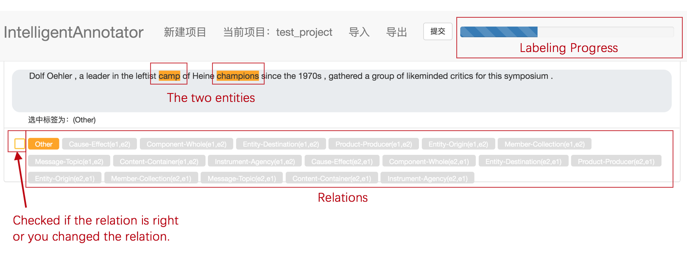

# Intelligent-Annotator
This is an intelligent relationship labeling system.

Simply clone the project to the local, then open the website, select the new project or directly replace the project.
After the project is replaced, you can see the following figure.

Because this is one of our SRTP projects, it may not be very good in use. In addition, the location of the two entities needs to be calibrated in the uploaded data file. The dataset used in the project is SemEval2010Task8.

